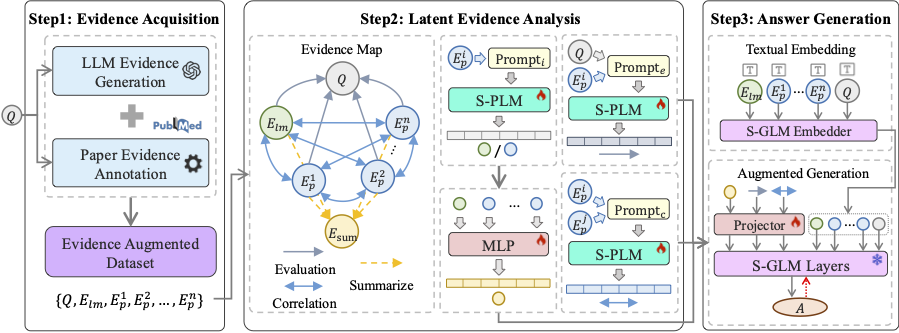

# EvidenceMap

## Framework


## Requirements
```
torch == 2.5.1
transformers == 4.48.1
evaluate == 0.4.3
```

## Instructions

### Modify config.py 

```
--framework: 'evimap_emb') # Supports 'rag', 'evimap_hard', 'llm_thought', 'rag_cot'
--source: ['llm', 'paper']
--analysis: ['sup', 'rel', 'sum']
--dataset_name: BioASQ
--llm_model: /path/to/llama-3.2-3b-instruct
--plm_model: /path/to/distilbert-base
```

### Run train.py

```
python train.py
```

## Citation
```
@misc{zong2025evidencemapunleashingpowersmall,
      title={EvidenceMap: Unleashing the Power of Small Language Models with Evidence Analysis for Biomedical Question Answering}, 
      author={Chang Zong and Jian Wan and Lei Zhang},
      year={2025},
      eprint={2501.12746},
      archivePrefix={arXiv},
      primaryClass={cs.CL},
      url={https://arxiv.org/abs/2501.12746}, 
}
```